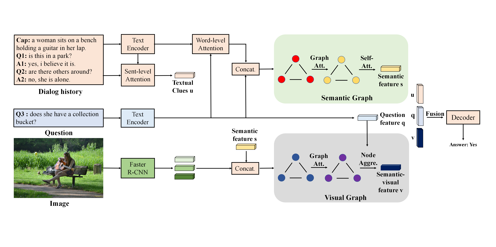

# SEMANTIC-VISUAL GRAPH REASONING FOR VISUAL DIALOG [ICME'24, Oral]

By Dongze Hao, Qunbo Wang and Jing Liu

## Introduction

This is the official implementation of the paper.  In this paper, we propose a Semantic-Visual Graph
Reasoning framework (SVG) for VisDial. Specifically, we
first construct a semantic graph to capture the semantic rela-
tionships between different entities in the current question and
the dialog history. Secondly, we construct a semantics-aware
visual graph to capture high-level visual semantics including
key objects of the image and their visual relationships. Exten-
sive experimental results on the VisDial v0.9 and v1.0 show
that our method has shown superior performance compared
to the state-of-the-art models across most evaluation metrics.

## Architecture



## Setup and Dependencies

```bash
conda create -n svg python=3.8
conda activate svg
conda conda install pytorch==1.7.0 torchvision==0.8.0 torchaudio==0.7.0 cudatoolkit=10.2 -c pytorch
pip install tqdm pyyaml nltk setproctitle
```

## Getting Started
1. Download the data
- Download the VisDial v0.9 and v1.0 dialog json files from [here](https://visualdialog.org/data) and keep it under `$PROJECT_ROOT/data/v0.9` and `$PROJECT_ROOT/data/v1.0` directory, respectively.
- [batra-mlp-lab](https://www.github.com/batra-mlp-lab/visdial-challenge-starter-pytorch) provides the word counts for VisDial v1.0 train split [`visdial_1.0_word_counts_train.json`](https://s3.amazonaws.com/visual-dialog/data/v1.0/2019/visdial_1.0_word_counts_train.json). 
  They are used to build the vocabulary. Keep it under `$PROJECT_ROOT/data/v1.0` directory.
- [batra-mlp-lab](https://www.github.com/batra-mlp-lab/visdial-challenge-starter-pytorch) provides Faster-RCNN image features pre-trained on Visual Genome. Keep it under `$PROJECT_ROOT/data/visdial_1.0_img` and set argument `img_feature_type` to `faster_rcnn_x101` in `config/hparams.py` file.
  * [`features_faster_rcnn_x101_train.h5`](https://s3.amazonaws.com/visual-dialog/data/v1.0/2019/features_faster_rcnn_x101_train.h5): Bottom-up features of 36 proposals from images of `train` split.
  * [`features_faster_rcnn_x101_val.h5`](https://s3.amazonaws.com/visual-dialog/data/v1.0/2019/features_faster_rcnn_x101_val.h5): Bottom-up features of 36 proposals from images of `val` split.
  * [`features_faster_rcnn_x101_test.h5`](https://s3.amazonaws.com/visual-dialog/data/v1.0/2019/features_faster_rcnn_x101_test.h5): Bottom-up features of 36 proposals from images of `test` split.
- [gicheonkang][5] provides pre-extracted Faster-RCNN image features, which contain bounding boxes information. Set argument `img_feature_type` to `dan_faster_rcnn_x101` in `config/hparams.py` file.
  * [`train_btmup_f.hdf5`][6]: Bottom-up features of 10 to 100 proposals from images of `train` split (32GB).
  * [`train_imgid2idx.pkl`][7]: `image_id` to bbox index file for `train` split 
  * [`val_btmup_f.hdf5`][8]: Bottom-up features of 10 to 100 proposals from images of `validation` split (0.5GB).
  * [`val_imgid2idx.pkl`][9]: `image_id` to bbox index file for `val` split
  * [`test_btmup_f.hdf5`][10]: Bottom-up features of 10 to 100 proposals from images of `test` split (2GB).
  * [`test_imgid2idx.pkl`][11]: `image_id` to bbox index file for `test` split 
    
2. Preprocess the data
- Download the GloVe pretrained word vectors from [here][12], and keep `glove.6B.300d.txt` under `$PROJECT_ROOT/data/word_embeddings/glove` directory. Run
    ```shell
    python data/preprocess/init_glove.py
    ```
- Preprocesse textual inputs
    ```shell
    python data/data_utils.py
    ```
3. Train the model
    ```shell
    python main.py --model svg --version 1.0
    ```
4. Evaluate the model
   ```shell
    python main.py --model svg --evaluate /path/to/checkpoint.pth --eval_split val --version 1.0
    ```
##  Acknowledgements

This code is reimplemented as a fork of [batra-mlp-lab/visdial-challenge-starter-pytorch][1] and [yuleiniu/rva][2].

[1]: https://www.github.com/batra-mlp-lab/visdial-challenge-starter-pytorch
[2]: https://github.com/yuleiniu/rva
[5]: https://github.com/yuleiniu/rva
[6]: https://drive.google.com/file/d/1NYlSSikwEAqpJDsNGqOxgc0ZOkpQtom9/view?usp=sharing
[7]: https://drive.google.com/file/d/1QSi0Lr4XKdQ2LdoS1taS6P9IBVAKRntF/view?usp=sharing
[8]: https://drive.google.com/file/d/1NI5TNKKhqm6ggpB2CK4k8yKiYQE3efW6/view?usp=sharing
[9]: https://drive.google.com/file/d/1nTBaLziRIVkKAqFtQ-YIbXew2tYMUOSZ/view?usp=sharing
[10]: https://drive.google.com/file/d/1BXWPV3k-HxlTw_k3-kTV6JhWrdzXsT7W/view?usp=sharing
[11]: https://drive.google.com/file/d/1_32kGhd6wKzQLqfmqJzIHubfZwe9nhFy/view?usp=sharing
[12]: http://nlp.stanford.edu/data/glove.6B.zip